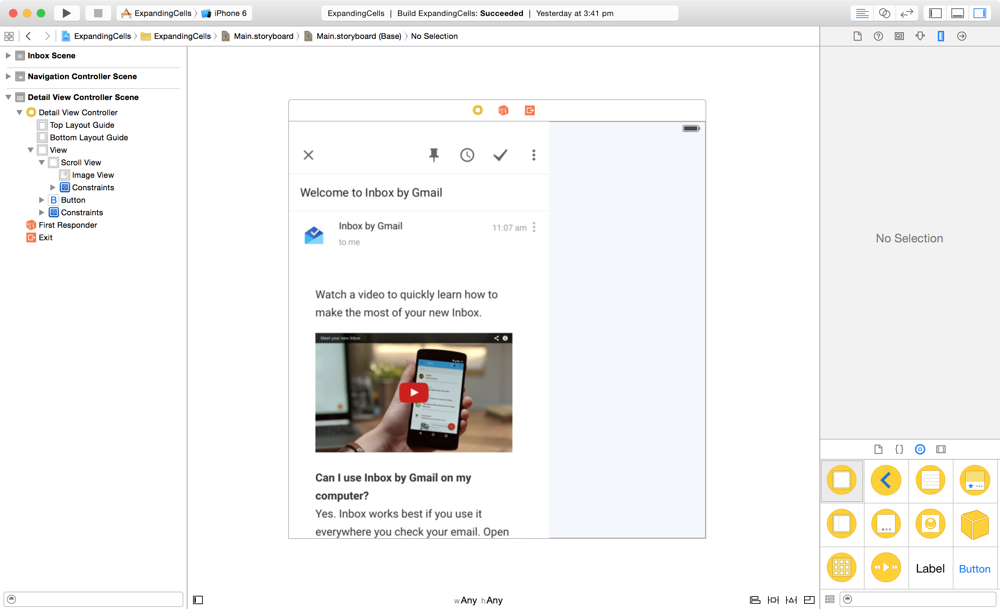
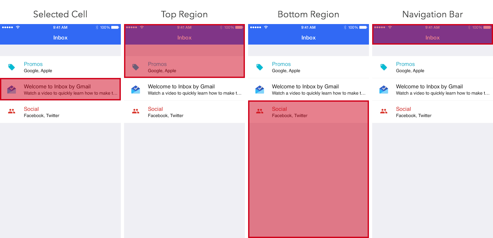

# inbox-replica
Recreated the expanding cells effect from `Inbox` by Google in Swift

# Goal
We are going to recreate the expanding cells effect from [Inbox](https://itunes.apple.com/sg/app/inbox-by-gmail-inbox-that/id905060486?mt=8) by Google. The final result looks something like this:


# Observations
### The cell expands to fill the screen when tapped
The cell grows and the portions of the screen around it move outward from it (the part above moves upward and the portion below it moves downwards)

### The navigation bar stays around until it's pushed by the expanding cell
You would only notice this if you look really closely. You might have to watch this a few times.

### Swiping downward in the detail screen brings back the first screen
When scrolling downward brings in the navigation bar from the first screen. The status bar also changes color to be more easily visible. If released at a certain threshold the view controller dismisses and transitions back the the presenting one.

# Game Plan
We'll configure a UITableViewController to display rows of items. Next we'll create a modal transition that performs the expanding effect. Finally we'll have the detail view controller support some of the transition details when scrolling.

# Blueprint
Setting up the Table View
Start a new Xcode project with the Single View Application template. Go into Main.storyboard and remove the default view controller (click on it and press delete.)

Drag the Table View Controller from the Object Library onto the storyboard. We're using a collection view because we can represent each room as a collection view cell. Setup the table view as shown below by adding table view cells (and the relevant subviews, i.e. labels and image views) and adding auto layout constraints:


Change the type of Content of the table view to Static Cells for this example and the Style to Grouped.

Create a UITableViewController subclass called MainViewController and set this up in the Identity Inspector in the storyboard. Also ensure Is Initial View Controller is checked in the Attributes Inspector. Remove all the placeholder Data Source and Delegate methods.

Add the following method to ensure the separators between cells stretch across the screen:

```javascript
// MARK: UITableViewDelegate
extension MainTableViewController
{
    override func tableView(tableView: UITableView, willDisplayCell cell: UITableViewCell, forRowAtIndexPath indexPath: NSIndexPath) {

        cell.separatorInset = UIEdgeInsetsZero
        cell.layoutMargins = UIEdgeInsetsZero
        cell.preservesSuperviewLayoutMargins = false
    }
}
```

Build and run and you should see the following:


Next, with the view controller selected in the storyboard, select from Editor menu, Embed In and then Navigation Controller. Next select the navigation bar from the view hierarchy and in the Attributes Inspector, change the Style to Black, uncheck Translucent and set the Bar Tint Color accordingly.

>Black simply makes the status bar show up in white. This is legacy terminology from before iOS allowed appearance customizations in the navigation bar (and navigation bars only came in blue or black).

Add a title to our MainViewController, build and run.

## Hacking up a Detail View
Next we will add a quick and dirty detail view controller so we can started with the custom transition. Add a new UIViewController subclass to the project called DetailViewController. Add a corresponding view controller to the storyboard.

In this example, I will be just adding an image view inside of a scroll view. The layout looks like this:



>In an actual app, you could display your content using any UIScrollView subclass (even table views or collection views.)

Add a close button and any Auto Layout constraints you require. Next add the following action in the Connections Inspector:

```swift
@IBAction func handleCloseButton(sender: AnyObject) {
    dismissViewControllerAnimated(true, completion: nil)
}
```

Add set the Storyboard ID in the Identity Inspector to DetailViewController. All we need to do now is have our MainViewController present the DetailViewController when the table row is tapped.

Add the following table view delegate method to MainViewController:

```swift
// MARK: UITableViewDelegate
extension MainTableViewController
{
    ...

    override func tableView(tableView: UITableView, didSelectRowAtIndexPath indexPath: NSIndexPath) {
        selectedIndexPath = indexPath

        let controller = UIStoryboard(name: "Main", bundle: nil).instantiateViewControllerWithIdentifier("DetailViewController") as! DetailViewController
        presentViewController(controller, animated: true, completion: nil)
    }
}
```

Build and run and you should see the following:


## Building the Transition



Have a look at the above diagram. When the transition begins, we would render snapshots of the screen in the different regions above (the cell that's being tapped, the region above, the region below and the navigation bar) and animate these pieces separately.

+ The cell snapshot needs to expand the full screen.
+ The top region snapshot needs to move upward and out of view.
+ The bottom region snapshot needs to move downward and out of view.
+ The navigation bar snapshot needs to stay on top of all the other snapshots. When the bottom of the top snapshot becomes aligned with it, animate upward along with it.

Create a new class called ExpandingCellTransition and add the following boilerplate transition code we had in the previous teardowns:

```swift
private let kExpandingCellTransitionDuration: NSTimeInterval = 0.6

class ExpandingCellTransition: NSObject, UIViewControllerAnimatedTransitioning {  
    func transitionDuration(transitionContext: UIViewControllerContextTransitioning) -> NSTimeInterval {
        return kExpandingCellTransitionDuration
    }

    func animateTransition(transitionContext: UIViewControllerContextTransitioning) {
        let duration = transitionDuration(transitionContext)
        let fromViewController = transitionContext.viewControllerForKey(UITransitionContextFromViewControllerKey)!
        let toViewController = transitionContext.viewControllerForKey(UITransitionContextToViewControllerKey)!
        let containerView = transitionContext.containerView()

        // setup animation
        containerView.addSubview(fromViewController.view)
        containerView.addSubview(toViewController.view)
        toViewController.view.alpha = 0

        // perform animation
        UIView.animateWithDuration(duration, delay: 0, usingSpringWithDamping: 1, initialSpringVelocity: 0, options: .allZeros, animations: { () -> Void in
            [self]
            toViewController.view.alpha = 1
            }, completion: {
                (finished) in
                transitionContext.completeTransition(!transitionContext.transitionWasCancelled())
        })
    }
}
```

Next because this is going to be a modal transition we need to supply a UIViewControllerTransitioningDelegate. Make the following changes to our transition class:

```swift
class ExpandingCellTransition: NSObject, UIViewControllerAnimatedTransitioning, UIViewControllerTransitioningDelegate {  
    ...

     func animationControllerForPresentedController(presented: UIViewController, presentingController presenting: UIViewController, sourceController source: UIViewController) -> UIViewControllerAnimatedTransitioning? {
        return self
    }

    func animationControllerForDismissedController(dismissed: UIViewController) -> UIViewControllerAnimatedTransitioning? {
        return self
    }
}
```

Now we need to setup the transitioningDelegate property in our DetailViewController:

```swift
let transition = ExpandingCellTransition()

override func viewDidLoad() {  
    super.viewDidLoad()
    transitioningDelegate = transition
}
```

Build and run and you should see the following:


Before we can move on, we need to decide how our transition object should communicate (if at all) with our view controllers.

With the presenting view controller, our transition object needs to know about the cell being tapped on. It needs this because it affects the snapshots are sliced up (tapping the first cell generates different snapshots when compared to tapping, say, the third cell.)

With the presented view controller, our transition object has needs to pass over the snapshot of the navigation bar for the dismissal effect we will see later on.

Add the following protocols to the bottom of the file containing our transition object, ExpandingCellTransition:

```swift
@objc
protocol ExpandingTransitionPresentingViewController {  
    func expandingTransitionTargetViewForTransition(transition: ExpandingCellTransition) -> UIView!
}

@objc
protocol ExpandingTransitionPresentedViewController {  
    func expandingTransition(transition: ExpandingCellTransition, navigationBarSnapshot: UIView)
}
```

Let's implement the first protocol in MainViewController. We first store the indexPath with the cell is selected, and later retrieve the cell at this indexPath in order to hand it over the transition object:

```swift
// MARK: ExpandingTransitionPresentingViewController
extension MainTableViewController
{
    func expandingTransitionTargetViewForTransition(transition: ExpandingCellTransition) -> UIView! {
        if let indexPath = selectedIndexPath {
            return tableView.cellForRowAtIndexPath(indexPath)
        } else {
            return nil
        }
    }
}
```

Next we check that our presenting view controller conforms to our protocol, otherwise fallback on the default system transition. We're also going to store the type of transition we need (presenting or dismissing.) Update ExpandingCellTransition with the following:

```swift
enum TransitionType {  
    case None
    case Presenting
    case Dismissing
}

var type: TransitionType = .None  
var presentingController: UIViewController!  
var presentedController: UIViewController!

...
func animationControllerForPresentedController(presented: UIViewController, presentingController presenting: UIViewController, sourceController source: UIViewController) -> UIViewControllerAnimatedTransitioning? {  
    presentingController = presenting
    if let navController = presentingController as? UINavigationController {
        presentingController = navController.topViewController
    }

    if presentingController is ExpandingTransitionPresentingViewController {
        type = .Presenting
        return self
    }
    else {
        type = .None
        return nil
    }
}

func animationControllerForDismissedController(dismissed: UIViewController) -> UIViewControllerAnimatedTransitioning? {  
    if presentingController is ExpandingTransitionPresentingViewController {
        type = .Dismissing
        return self
    }
    else {
        type = .None
        return nil
    }
}
```

Let's continue with our transition. First we need to figure out which of the view controllers should be in the foreground and which should be in the background. Because we stored the transition state earlier, this is somewhat trivial:

```swift
func animateTransition(transitionContext: UIViewControllerContextTransitioning) {  
    ...
    let containerView = transitionContext.containerView()

    var foregroundViewController = toViewController
    var backgroundViewController = fromViewController

    if type == .Dismissing {
        foregroundViewController = fromViewController
        backgroundViewController = toViewController
    }

    containerView.addSubview(backgroundViewController.view)
    containerView.addSubview(foregroundViewController.view)
}
```

Now we can ask the background view controller for the target view:

```swift
func animateTransition(transitionContext: UIViewControllerContextTransitioning) {  
    ...
    // get target view
    var targetViewController = backgroundViewController
    if let navController = targetViewController as? UINavigationController {
        targetViewController = navController.topViewController
    }
    let targetViewMaybe = (targetViewController as? ExpandingTransitionPresentingViewController)?.expandingTransitionTargetViewForTransition(self)

    assert(targetViewMaybe != nil, "Cannot find target view in background view controller")

    let targetView = targetViewMaybe!
}
```

We're almost ready to perform the animation. Let's now introduce some helper methods to make this easier. The first of which serves to help us slice the snapshots.

We'll add a handful of properties to keep track of these new views:

```swift
var targetSnapshot: UIView!  
var targetContainer: UIView!

var topRegionSnapshot: UIView!  
var bottomRegionSnapshot: UIView!  
var navigationBarSnapshot: UIView!
```

Now we'll add the corresponding method, sliceSnapshotsInBackgroundViewController():

```swift
func sliceSnapshotsInBackgroundViewController(backgroundViewController: UIViewController, targetFrame: CGRect, targetView: UIView) {  
    let view = backgroundViewController.view
    let width = view.bounds.width
    let height = view.bounds.height

    // create top region snapshot
    topRegionSnapshot = view.resizableSnapshotViewFromRect(CGRect(x: 0, y: 0, width: width, height: targetFrame.minY), afterScreenUpdates: false, withCapInsets: UIEdgeInsetsZero)

    // create bottom region snapshot
    bottomRegionSnapshot = view.resizableSnapshotViewFromRect(CGRect(x: 0, y: targetFrame.maxY, width: width, height: height-targetFrame.maxY), afterScreenUpdates: false, withCapInsets: UIEdgeInsetsZero)

    // create target view snapshot
    targetSnapshot = targetView.snapshotViewAfterScreenUpdates(false)
    targetContainer = UIView(frame: targetFrame)
    targetContainer.backgroundColor = UIColor.whiteColor()
    targetContainer.clipsToBounds = true
    targetContainer.addSubview(targetSnapshot)

    // create navigation bar snapshot
    if let navController = backgroundViewController as? UINavigationController {
        let barHeight = navController.navigationBar.frame.maxY

        UIGraphicsBeginImageContext(CGSize(width: width, height: barHeight))
        view.drawViewHierarchyInRect(view.bounds, afterScreenUpdates: false)
        let navigationBarImage = UIGraphicsGetImageFromCurrentImageContext()
        UIGraphicsEndImageContext()

        navigationBarSnapshot = UIImageView(image: navigationBarImage)
        navigationBarSnapshot.backgroundColor = navController.navigationBar.barTintColor
        navigationBarSnapshot.contentMode = .Bottom
    }
}
```

We create the snapshot in 2 main ways here. The first of which is to use the built-in UIKit methods for generating snapshots. The UIView method snapshotViewAfterScreenUpdates() turns the entire view into a snapshot while resizableSnapshotViewFromRect() takes a region of a view and turns that into a snapshot.

The second method is to generate UIImages and create UIImageViews to host them. To create UIImages, we have to drop down into the Core Graphics API. Nevertheless, we can work easily using the UIKit convenience methods UIGraphicsBeginImageContext() and UIGraphicsEndImageContext(). Any drawing functions have to be called between these pairs of functions.

We use the drawViewHierarchyInRect() method on UIView to draw the view's contents into the current image context. Finally we use UIGraphicsGetImageFromCurrentImageContext() to retrieve the UIImage from the image context.

>We use the UIImage approach for the navigation bar snapshot because we'd want a bit more flexibility on how its displayed later.

Now we'll add a second method to configure the state of the snapshots we created above. Firstly we'll need a state enumeration:

```swift
enum TransitionState {  
    case Initial
    case Final
}
```

The corresponding configuration method is as follows:

```swift
func configureViewsToState(state: TransitionState, width: CGFloat, height: CGFloat, targetFrame: CGRect, fullFrame: CGRect, foregroundView: UIView) {  
    switch state {
    case .Initial:
        topRegionSnapshot.frame = CGRect(x: 0, y: 0, width: width, height: targetFrame.minY)
        bottomRegionSnapshot.frame = CGRect(x: 0, y: targetFrame.maxY, width: width, height: height-targetFrame.maxY)
        targetContainer.frame = targetFrame
        targetSnapshot.alpha = 1
        foregroundView.alpha = 0
        navigationBarSnapshot.sizeToFit()

    case .Final:
        topRegionSnapshot.frame = CGRect(x: 0, y: -targetFrame.minY, width: width, height: targetFrame.minY)
        bottomRegionSnapshot.frame = CGRect(x: 0, y: height, width: width, height: height-targetFrame.maxY)
        targetContainer.frame = fullFrame
        targetSnapshot.alpha = 0
        foregroundView.alpha = 1
    }
}
```

Here we simply position the snapshots in the right order, hiding the foreground view controller in the initial state. In the final state, we hide the cell, move the top and bottom region snapshots away and make the foreground view controller visible.

We'll make a final update to animateTransition() to finish the effect:

```swift
func animateTransition(transitionContext: UIViewControllerContextTransitioning) {  
    // setup animation
    let targetFrame = backgroundViewController.view.convertRect(targetView.frame, fromView: targetView.superview)
    if type == .Presenting {
        sliceSnapshotsInBackgroundViewController(backgroundViewController, targetFrame: targetFrame, targetView: targetView)
    }

    targetContainer.addSubview(foregroundViewController.view)
    containerView.addSubview(targetContainer)
    containerView.addSubview(topRegionSnapshot)
    containerView.addSubview(bottomRegionSnapshot)
    containerView.addSubview(navigationBarSnapshot)

    let width = backgroundViewController.view.bounds.width
    let height = backgroundViewController.view.bounds.height

    let preTransition: TransitionState = (type == .Presenting ? .Initial : .Final)
    let postTransition: TransitionState = (type == .Presenting ? .Final : .Initial)

    configureViewsToState(preTransition, width: width, height: height, targetFrame: targetFrame, fullFrame: foregroundViewController.view.frame, foregroundView: foregroundViewController.view)

    // perform animation
    backgroundViewController.view.hidden = true
    UIView.animateWithDuration(duration, delay: 0, usingSpringWithDamping: 1, initialSpringVelocity: 0, options: .allZeros, animations: { () -> Void in
        [self]
        self.configureViewsToState(postTransition, width: width, height: height, targetFrame: targetFrame, fullFrame: foregroundViewController.view.frame, foregroundView: foregroundViewController.view)

        if self.type == .Presenting {
            self.navigationBarSnapshot.frame.size.height = 0
        }


    }, completion: {
        (finished) in
        [self]
        self.targetContainer.removeFromSuperview()
        self.topRegionSnapshot.removeFromSuperview()
        self.bottomRegionSnapshot.removeFromSuperview()
        self.navigationBarSnapshot.removeFromSuperview()

        containerView.addSubview(foregroundViewController.view)
        backgroundViewController.view.hidden = false
        transitionContext.completeTransition(!transitionContext.transitionWasCancelled())
    })
}
```

Firstly, we calculate the frame of the target view in the coordinates of the background view controller. Then only if we are presenting, we make the call to sliceSnapshotsInBackgroundViewController() to create the snapshots.

Next we add all the snapshots to the container view. Finally we configure the views before animation and again in the animation block.

After the animation, we need to remember to remove all the snapshots.

Build and run and you should see the following:


## Pulling to Dismiss

Now we'll add the pull-to-dismiss gesture to our detail view controller. First, let's have the DetailViewController implement the ExpandingTransitionPresentedViewController protocol:

```swift
class DetailViewController: UIViewController, ExpandingTransitionPresentedViewController {  
    var navigationBarSnapshot: UIView!
    var navigationBarHeight: CGFloat = 0

    ...
}

// MARK: ExpandingTransitionPresentedViewController
extension DetailViewController: ExpandingTransitionPresentedViewController {

    func expandingTransition(transition: ExpandingCellTransition, navigationBarSnapshot: UIView) {
        self.navigationBarSnapshot = navigationBarSnapshot
        self.navigationBarHeight = navigationBarSnapshot.frame.height
    }
}

```

We've simply chosen to store it away in a property at this stage. Next when our detail view controller is presented, we need to position the snapshot above our scroll view contents add it to our scroll view:

```swift
override func viewDidAppear(animated: Bool) {  
    super.viewDidAppear(animated)
    if navigationBarSnapshot != nil {
        navigationBarSnapshot.frame.origin.y = -navigationBarHeight
        scrollView.addSubview(navigationBarSnapshot)
    }
}
```

>You might need to create an outlet to the scroll view from the storyboard.

We'll also need to adjust the height of the snapshot as we scroll so it will start from the top of the screen:

```swift
// MARK: UIScrollViewDelegate
extension DetailViewController: UIScrollViewDelegate
{
    func scrollViewDidScroll(scrollView: UIScrollView) {
        if !isBeingDismissed() {
            navigationBarSnapshot.frame = CGRect(x: 0, y: scrollView.contentOffset.y, width: view.bounds.width, height: -scrollView.contentOffset.y)
        }
    }
}
```

>Remember to set the scroll view's delegate to the view controller.

Finally we'll make the change in the transition object to pass the snapshot over:

```swift
func animateTransition(transitionContext: UIViewControllerContextTransitioning) {  
    ...

    // setup animation
    let targetFrame = backgroundViewController.view.convertRect(targetView.frame, fromView: targetView.superview)
    if type == .Presenting {
        sliceSnapshotsInBackgroundViewController(backgroundViewController, targetFrame: targetFrame, targetView: targetView)
        (foregroundViewController as? ExpandingTransitionPresentedViewController)?.expandingTransition(self, navigationBarSnapshot: navigationBarSnapshot)
    }

    ...
}   
```

Build and run and you should see the following:


Next we want the status bar to change to the appropriate style as the scroll view scrolls:

```swift
override func preferredStatusBarStyle() -> UIStatusBarStyle {  
    if scrollView.contentOffset.y < -navigationBarHeight/2 {
        return .LightContent
    }
    return .Default
}
```

We'll animate this in scrollViewDidScroll():
```swift
// MARK: UIScrollViewDelegate
extension DetailViewController: UIScrollViewDelegate
{
  func scrollViewDidScroll(scrollView: UIScrollView) {
      if !isBeingDismissed() {
          navigationBarSnapshot.frame = CGRect(x: 0, y: scrollView.contentOffset.y, width: view.bounds.width, height: -scrollView.contentOffset.y)
      }

      UIView.animateWithDuration(0.3, animations: { () -> Void in
          [self]
          self.setNeedsStatusBarAppearanceUpdate()
      })
  }
}

Build and run and you should see the following:


Let's have the detail view controller dismiss when the threshold of half the navigation bar height is reached:

```swift
// MARK: UIScrollViewDelegate
extension DetailViewController: UIScrollViewDelegate
{
    func scrollViewDidScroll(scrollView: UIScrollView) {
        if !isBeingDismissed() {
            navigationBarSnapshot.frame = CGRect(x: 0, y: scrollView.contentOffset.y, width: view.bounds.width, height: -scrollView.contentOffset.y)
        }

        UIView.animateWithDuration(0.3, animations: { () -> Void in
            [self]
            self.setNeedsStatusBarAppearanceUpdate()
        })
    }

    func scrollViewDidEndDragging(scrollView: UIScrollView, willDecelerate decelerate: Bool) {
        if scrollView.contentOffset.y < -navigationBarHeight/2 {
            dismissViewControllerAnimated(true, completion: nil)
        }
    }
}
```

When dismissed, we want our transition to animate the navigation bar snapshot from its current position (which changes as the scroll view scrolls.) So we have to convert the current frame of the navigation bar snapshot back to the container view's origin:

```swift
func animateTransition(transitionContext: UIViewControllerContextTransitioning) {  
    ...
    // setup animation
    let targetFrame = backgroundViewController.view.convertRect(targetView.frame, fromView: targetView.superview)
    if type == .Presenting {
        ...
    }
    else {
        navigationBarSnapshot.frame = containerView.convertRect(navigationBarSnapshot.frame, fromView: navigationBarSnapshot.superview)
    }
    ...
}
```

Build and run and you should see the following:


## Afterthoughts
That's it, we've created the Expanding Cells effect. You've learnt how to:

+ Setup and implement the UIViewControllerAnimatedTransitioning protocol
+ Override transitions using UIViewControllerTransitioningDelegate
+ Create a modal controller transition that can be used generally by defining our own protocol
+ Hook the scrolling behavior of any UIScrollView to make changes to the status bar
+ Hook the dragging behavior of any UIScrollView to perform a custom action

inspired by [matthewcheoks' blog entry](http://blog.matthewcheok.com/design-teardown-preview-expanding-cells/)
